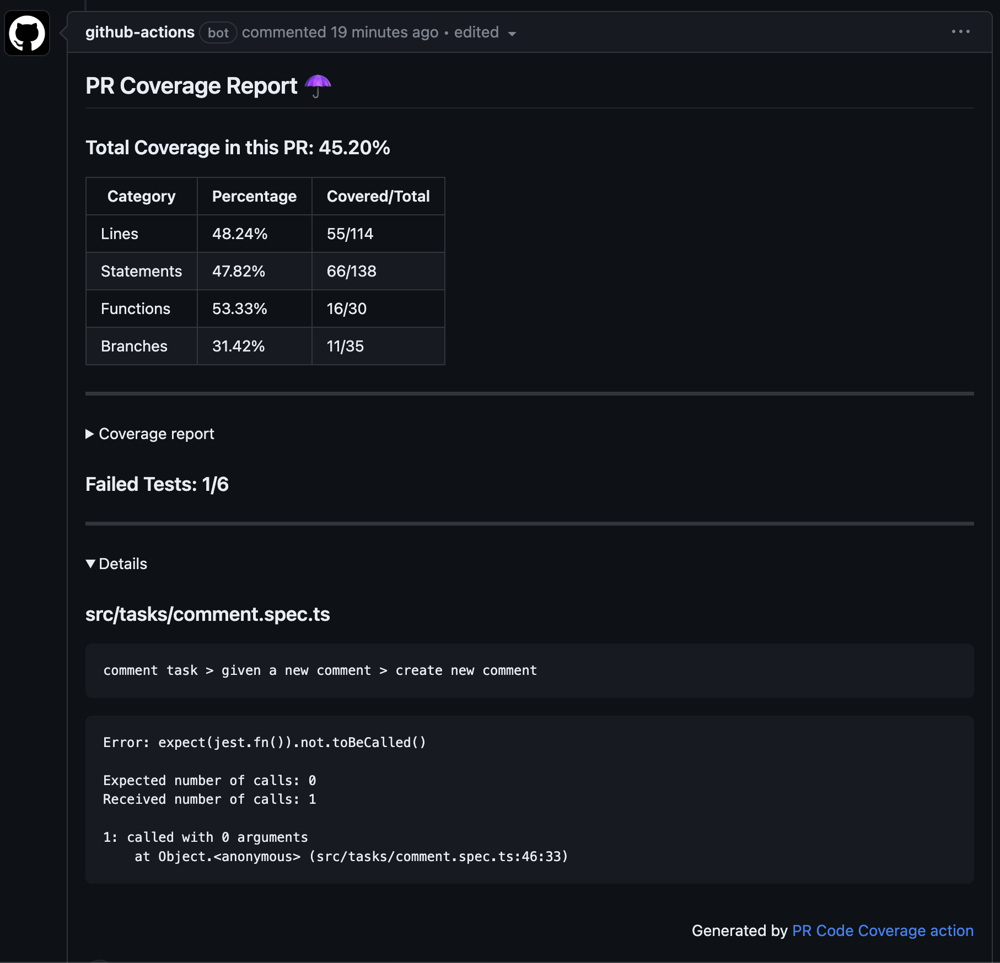

[jest]: https://jestjs.io/

# Jest PR Code Coverage

This action run [jest](jest) and generate coverage report for all the files in the PR.



## Inputs

### `github-token` - **required**

A github token is required. If you are using the default one generated by github.com, please ensure that you check `read and write permissions` in the repository action settings.

## Usage

- You will need to have [jest](jest) as a dependecy in your project

- This action will not work with `collectCoverageFrom` option. Please remove this option if you are using

- In your workflow files:

```
- name: Coverage
  uses: abolkog/jest-pr-code-coverag

```

## Contributing

Pull requests are welcome. Please make sure to check the [CONTRIBUTING.md](./CONTRIBUTING.md) guide first.

## License

This project is licensed under the MIT License - see the [LICENSE.md](LICENSE.md) file for details
